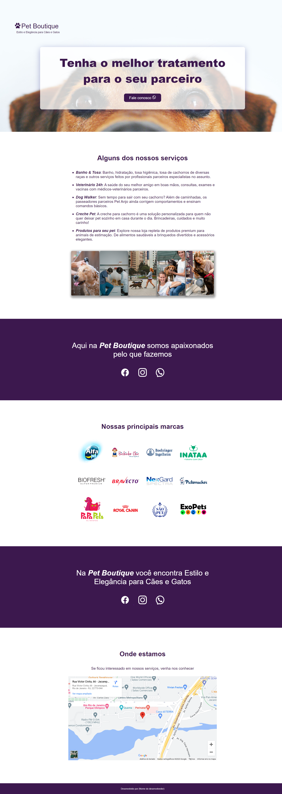

# Pet Boutique - Estilo e Elegância para Cães e Gatos

## Descrição do Projeto

O **Pet Boutique** é um site desenvolvido em HTML e CSS, focado em oferecer serviços de alta qualidade para cães e gatos. O projeto foi criado com o objetivo de proporcionar uma experiência visual agradável e intuitiva aos usuários, destacando os serviços oferecidos pela empresa e promovendo sua marca.

## Visualização do Layout

...

...

## Visão Geral

O site está estruturado da seguinte forma:

1. **Cabeçalho (Header)**

   - Logotipo da Pet Boutique.
   - Frase de abertura: "Estilo e Elegância para Cães e Gatos".
   - Imagem de fundo com um cachorro, reforçando o foco no público-alvo.

2. **Seção Principal (Hero Section)**

   - Título principal: "Tenha o melhor tratamento para o seu parceiro".
   - Botão de chamada à ação: "Fale conosco" com ícone do WhatsApp.

3. **Serviços Oferecidos**

   - Lista de serviços:
     - Banho & Tosa
     - Veterinário 24h
     - Dog Walker
     - Creche Pet
     - Produtos para seu pet
   - Imagens ilustrativas para cada serviço.

4. **Sobre Nós**

   - Texto informativo sobre a paixão da Pet Boutique pelos animais.
   - Ícones das redes sociais (Facebook, Instagram, WhatsApp).

5. **Marcas Parceiras**

   - Logotipos de várias marcas renomadas no setor de produtos para pets.

6. **Localização**

   - Mapa interativo mostrando a localização física da Pet Boutique.
   - Informações de contato (endereço e telefone).

7. **Rodapé (Footer)**
   - Créditos ao desenvolvedor.

## Tecnologias Utilizadas

- **HTML**: Estrutura do site.
- **CSS**: Estilização visual.
- **Google Maps API**: Integração do mapa interativo.

## Como Executar o Projeto

1. Clone o repositório:
   ```bash
   git clone https://github.com/fau-33/-pet-boutique/tree/main
   ```
